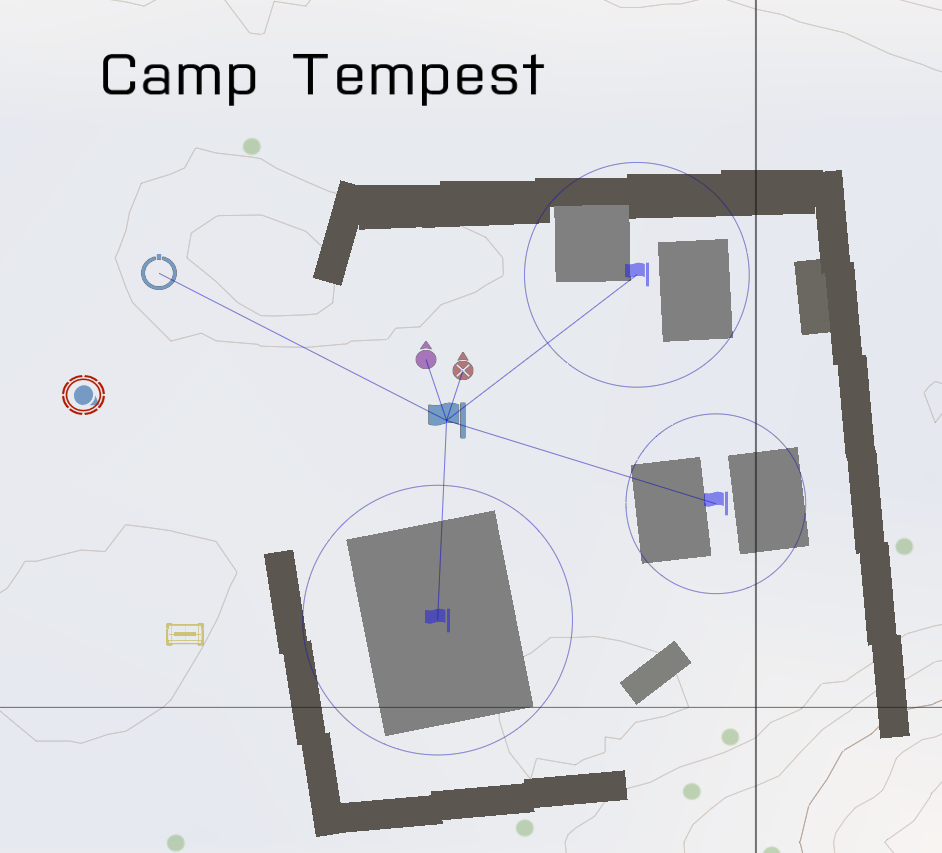
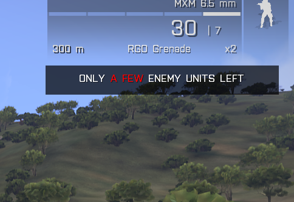
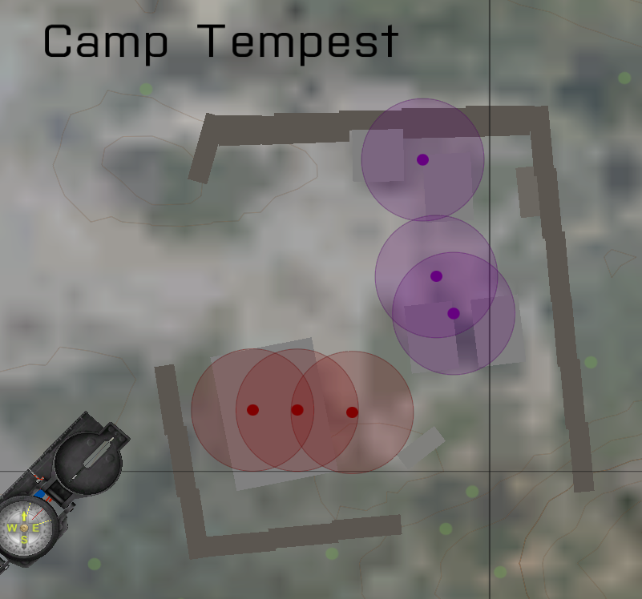

# @hehu_mf (Arma 3 addon)

> HEHU Mission Framework

## Features

HEHU Mission Framework is a mod that contains modules that can help you build more dynamic and rich missions faster. All the modules are meant to represent a pattern that we find useful for making fun and angaging co-op missions. It's build primarily for my group, but with this open source license everyone can make use of the code for their own groups.

* **Modules**
	* **CQB Spawner** places units randomly in certain areas; optionally giving them patrolling behavior.
	* **Target counter** shows a count of enemies alive.
	* **Unit locator** shows the position of certain units under certain conditions.
	* **Automatic end game** ends the game automatically when all enemies are dead.
* **Assets**
	* Ammo box with Virtual Armory and no vanilla inventory.
* **Autozeus**
  * Allows you and any other player to become Zeus on every mission, vanilla or otherwise.
  * We play in a closed group, so I'm not afraid of abuse.
  * Requires ACE3.

## Usage

### CQB Spawner



CQB spawner spawns units in certain areas. Areas are marked using `Area` or `Base` Game Logics with synchronized triggers. `Area` places units randomly inside the trigger areas, while `Base` spawns them only inside available building positions in buildings inside the trigger area.

Synchronize units to the specific areas and the unit types will be randomized between them. Placing 1 Civilian, 1 OPFOR Officer and 2 OPFOR Riflemen means that at any given location there's a 25% chance of a civilian, 25% of an officer, and 50% chance of a rifleman.

A single spawner can have multiple areas with different unit loadouts, and each area can have several triggers synchronized.

#### Configuring from mission parameters

You can change CQB module settings by including mission parameters in your `description.ext`:

```hpp
class Params
{
  #include "\hehu_mf\CQB_Params.hpp"

  #include "\a3\functions_f\Params\paramWeather.hpp"
  #include "\a3\functions_f\Params\paramDaytimePeriod.hpp"
};
```

Your mission will then get parameters for number of units and alertness. These options apply to each CQB spawner individually.

If you want your own preset values / descriptions, you'll have to include the options explicitly:

```hpp
class Params
{
  class NumberOfUnits {
    title = "Number of units";
    texts[] = {"7", "10", "15", "20", "30", "40"};
    values[] = {7, 10, 15, 20, 30, 40};
    default = 20;
  };

  class UnitAlertness {
    title = "Unit alertness";
    texts[] = {"Stand still", "Respond to threats", "Some will patrol", "Most will patrol", "All will patrol"};
    values[] = {0, 1, 2, 3, 4};
    default = 0;
  };
};
```

#### Configuring from `init.sqf`

You can change CQB module settings by using the following variables:

* `HEHU_CQB_unit_count` -- The number of units on each CQB Spawner with "Use global config".
* `HEHU_CQB_alertness`
  * `0`: "Stand still"
  * `1`: "Respond to threats"
  * `2`: "Some will patrol"
  * `3`: "Most will patrol"
  * `4`: "All will patrol"

You could, for instance, set these depending on the player count or on the presence of other mods.

### Target counter



Target counter shows the number of enemies left on the mission.

* It can be enabled from a trigger if you don't want it running immediately.
* It can be configured to stop when no enemies are left.
* It can be configured to different degrees of accuracy:
  * **Exact** means that the exact number of units should be displayed.
  * **Inexact** means that "many", "few", "couple", etc. is shown.
  * **Unhelpful** just says if there are any units left or not.

### Unit locator



Unit locator shows the position of units on the map.

* It can be activated from a trigger.
* It can be configured to only show up to a certain number of units and show nothing when there's more than that.
  * This allows you to add a "The last enemy is in this general area" to reduce the length of Search & Destroy.
  * If number of units grows over the limit, the placement will disappear from the map again.
  * Set to `0` to display all the matching units.
* It can show different kinds of units:
  * Players
  * Non-players
  * Enemies
  * Opfor
  * Blufor
  * Independent
  * Civilians
  * Everyone
* Precision can be configured:
  * **Exact** shows the exact location with a dot.
  * **Accurate** shows a circle in which the unit is located somewhere.
  * **Inaccurate** grows the circle.
  * **Very inaccurate** shows a very large circle.
* You can enable it to only certain players or player groups ("Radio men get special intel"; "Bravo can see from the hill exactly, Alpha knows the approximate position from Bravo's descriptions", etc.)

### Automatic end game

Ends the game when no more enemies exist. Very simple, but speeds up the process of adding victory conditions to small-scale missions.

## Development

### Adding a new module

1. Copy the `addons\blank` directory to `addons\<your name>`.
2. Open the `$PBOPREFIX$` file and adjust the name.
3. Open the `config.cpp` file and adjust the mod name.

## Copyright / License

Copyright 2015 Magnus Bergmark <magnus.bergmark@gmail.com>

Uses assets from Bohemia Interactive. Code in this repo is released under the MIT license.
